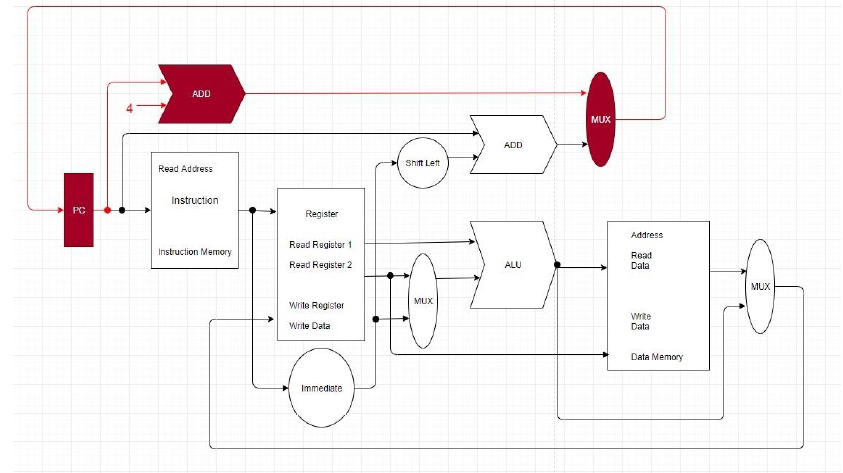
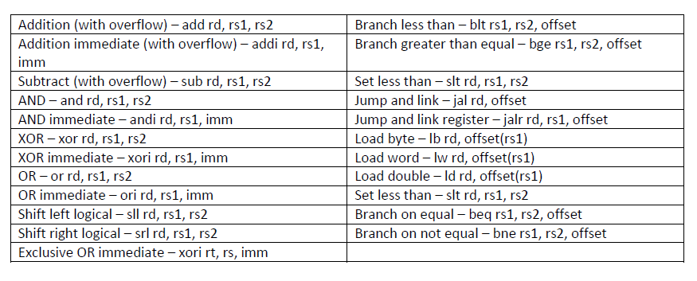
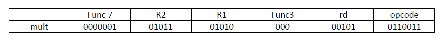
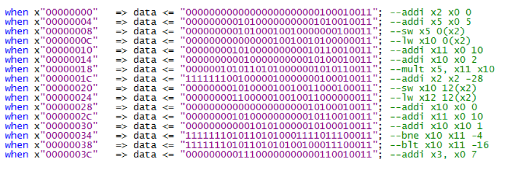

# Reduced-Instruction-Set-RISC-V-

Project contains a single cycle RISC-V architecture with reduced instruciton set. The implementation follows the architecture as described below.

Implemented intructions are:

Moreover, there is also a multiplication instruction that is computed in a single cycle. Its achieved by a booth multiplier

If you wish to write a program; edit file ROM.vhd and change the binary data corresponding to the instructions of your assembly code.

